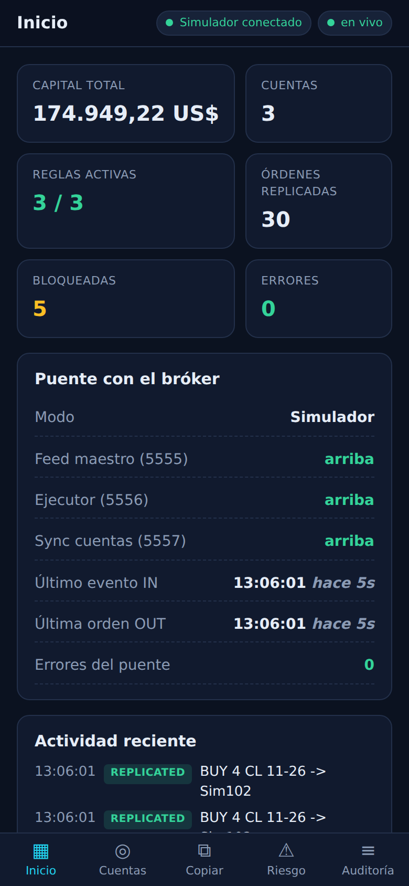
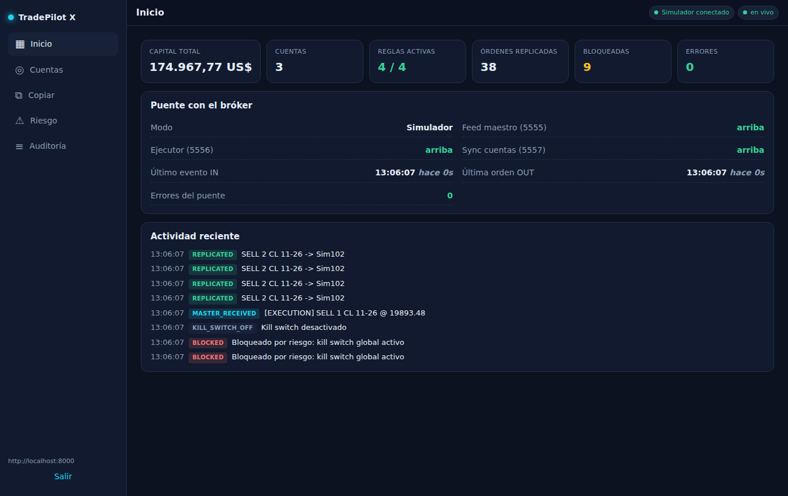

# TradePilot X

Replicador de órdenes para NinjaTrader con consola **web y móvil**. El motor corre junto a NinjaTrader; la consola se abre desde cualquier navegador o instalada como app en el teléfono.

Lee el diseño completo en [`docs/ARQUITECTURA.md`](docs/ARQUITECTURA.md).

| Móvil | Escritorio |
|---|---|
|  |  |

## Arranque rápido (modo simulador, sin NinjaTrader)

```bash
# 1. Consola web
cd web && npm install && npm run build

# 2. Engine (sirve la API y la web en http://localhost:8000)
cd ../engine
pip install -e ".[dev]"
cp .env.example .env         # edita API_TOKEN
python -m tradepilot.main
```

Abre <http://localhost:8000>, pon la URL del engine y el token. En modo simulador, el botón **"Simular operación del maestro"** de la pestaña *Copiar* genera operaciones para ver el replicador trabajando.

## Con NinjaTrader real (PC Windows)

1. En `engine/.env`: `ENGINE_MODE=ninja` (y los puertos ZMQ si no son 5555/5556/5557).
2. `powershell -File scripts/run_engine.ps1`
3. Para acceder desde fuera de casa sin abrir puertos: `cloudflared tunnel --url http://localhost:8000` (o Tailscale). Ver `docs/ARQUITECTURA.md` §2.

## Desarrollo

```bash
cd engine && python -m pytest          # pruebas del motor y la API
cd web && npm run dev                  # Vite con proxy a :8000 (hot reload)
```

Con Docker (solo modo simulador o con NinjaTrader accesible por red):

```bash
docker compose up --build
```
