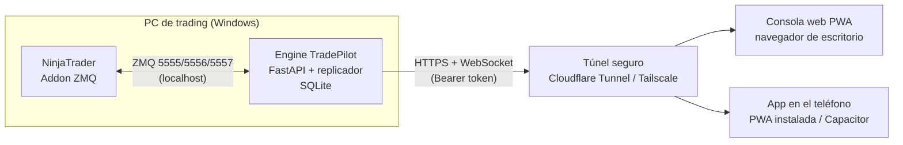

# TradePilot X — Reestructuración a web + móvil

## 1. De dónde venimos

La versión original (carpeta `legacy_flet/`) es una aplicación de escritorio en **Flet** (Python) que:

- Se conecta a **NinjaTrader** por **ZMQ** en `localhost` (5555 eventos del maestro, 5556 órdenes al ejecutor, 5557 sincronización de cuentas).
- Replica las operaciones de una cuenta maestra a cuentas seguidoras según reglas (multiplicador, filtro de símbolo).
- Guarda reglas y auditoría en SQLite.
- Dibuja la interfaz en el mismo proceso: solo se puede usar sentado delante de ese PC.

Problemas que arrastraba y que esta reestructuración corrige:

| Problema | Antes | Ahora |
|---|---|---|
| Solo accesible desde el PC de trading | UI Flet embebida en el proceso | UI web separada, accesible desde cualquier navegador o como app instalada en el teléfono |
| Bus interno sobre ZMQ loopback en el **puerto 5555**, el mismo que usa NinjaTrader para publicar | Choque de puertos / comportamiento errático | Bus de eventos en proceso (`core/events.py`), sin sockets |
| Imports relativos a la carpeta (`from bus.event_bus import bus`) | Solo funcionaba lanzando desde dentro de `tradepilot_x/` | Paquete instalable `tradepilot` con imports absolutos y `pyproject.toml` |
| Socket REQ que se quedaba bloqueado tras un timeout | Cuentas dejaban de sincronizar hasta reiniciar | El socket REQ se recrea tras timeout |
| SQLite abriendo una conexión por operación desde varias tareas | Riesgo de `database is locked` | Conexión única protegida por lock |
| Módulo de riesgo era un botón sin lógica | Kill switch decorativo | Kill switch real + límites por cuenta consultados antes de cada orden |
| Sin pruebas | — | 10 pruebas unitarias/API (`pytest`) y flujo end-to-end con Playwright |
| Nada versionado (un `.zip` con el `.venv` de Windows dentro) | — | Monorepo limpio, `.venv`/`node_modules` ignorados |

## 2. Principio de diseño: el motor vive junto a NinjaTrader, la consola vive donde tú estés

NinjaTrader solo habla ZMQ en `localhost`, así que **el motor de replicación tiene que seguir corriendo en ese PC Windows**. Lo que se saca fuera es la interfaz:



Componentes:

1. **`engine/`** (Python 3.11, FastAPI). Un solo proceso que:
   - Mantiene el puente con el bróker (`NinjaZmqBridge`) o un **simulador** (`MockBridge`) para desarrollar y hacer demos sin NinjaTrader.
   - Ejecuta el replicador y el módulo de riesgo.
   - Expone una **API REST** (`/api/...`) y un **WebSocket** (`/api/ws`) que empuja en tiempo real cuentas, salud del puente, auditoría y estado de riesgo.
   - Sirve la consola web compilada (`web/dist`) desde el mismo puerto, así solo hay que exponer **un** servicio.

2. **`web/`** (Vite + React + TypeScript, PWA). Interfaz *mobile-first*:
   - Barra de pestañas inferior en el teléfono, menú lateral en escritorio.
   - Instalable en iOS/Android desde el navegador ("Añadir a pantalla de inicio"), con icono y pantalla completa.
   - Recuerda la URL del engine y el token; reconecta el WebSocket sola.
   - La API nunca se cachea: siempre datos en vivo.

3. **Acceso remoto** (fase posterior; mientras se prueba, todo va por la Wi-Fi local con la IP del PC). El engine no debe abrirse a Internet directamente. Dos opciones, ambas sin abrir puertos en el router:
   - **Cloudflare Tunnel** (recomendado si quieres una URL tipo `https://tradepilot.tudominio.com` con HTTPS gratis y, opcionalmente, login de Cloudflare Access delante). `cloudflared tunnel --url http://localhost:8000`.
   - **Tailscale** (VPN privada; el teléfono y el PC quedan en la misma red virtual). Más simple, sin dominio, pero hay que instalar Tailscale en cada dispositivo.

   En ambos casos la API sigue exigiendo el `API_TOKEN`: es la segunda capa.

## 3. Estrategia móvil

| Fase | Qué | Esfuerzo | Estado |
|---|---|---|---|
| 1 | **PWA** instalable (lo que hay ahora) | Ya hecho | ✅ |
| 2 | **Notificaciones push** (Web Push desde el engine cuando hay `BLOCKED`, `ERROR` o kill switch) | Medio | pendiente |
| 3 | Empaquetar la misma web con **Capacitor** para publicar en App Store / Play Store si hace falta | Bajo-medio (no se reescribe nada) | opcional |

No hace falta una app nativa aparte: la PWA cubre el 90 % y Capacitor reutiliza el mismo código si en el futuro quieres tienda de apps.

## 4. Estructura del repositorio

```
engine/                     Motor Python (instalable, `pip install -e .`)
  tradepilot/
    core/       config, enums, bus de eventos, logging
    domain/     modelos Pydantic (cuentas, reglas, riesgo, auditoría)
    infrastructure/
      brokers/  base.py (contrato), ninja_zmq.py (real), mock.py (simulador)
      persistence/sqlite_store.py
    services/   account, replication, risk, audit
    api/        FastAPI: auth por token, rutas REST, WebSocket, servido del build web
    container.py  ensamblado de dependencias
    main.py       arranque uvicorn
  tests/                    pytest (dominio + API)
web/                        Consola PWA (Vite + React + TS)
  src/lib/      api.ts (cliente REST/WS), store.tsx (estado global + WS), format.ts
  src/pages/    Login, Dashboard (sala de control), Accounts, Replicator, Risk, Audit (filtros + exportación)
  src/components/ Shell (navegación + barra de estado), AccountPanel (posición, P&L en vivo, stops/TPs vivos),
                  PnlChart (SVG, paleta categórica validada, crosshair, tabla), ui
legacy_flet/                Código original de escritorio, solo referencia
docs/                       Este documento y capturas
scripts/                    Arranque en Windows
```

## 5. API

Todas las rutas requieren `Authorization: Bearer <API_TOKEN>` (o `?token=` en el WebSocket).

| Método | Ruta | Descripción |
|---|---|---|
| GET | `/api/health` | Modo, salud del puente, estado de riesgo, contadores |
| GET | `/api/accounts` | Cuentas sincronizadas |
| GET/POST | `/api/rules` | Listar / crear reglas |
| PATCH/DELETE | `/api/rules/{id}` | Editar (activar, multiplicador…) / borrar |
| GET | `/api/audit?limit=&event_type=` | Auditoría |
| GET | `/api/risk` | Kill switch + límites |
| POST | `/api/risk/kill-switch` | `{active, reason}` |
| PUT | `/api/risk/limits` | Límite por cuenta |
| POST | `/api/mock/master-event` | Solo modo mock: simular operación del maestro |
| WS | `/api/ws` | Eventos: `accounts.snapshot`, `broker.health`, `audit.event`, `risk.state` |

Documentación interactiva en `/docs` (Swagger) cuando el engine está arrancado.

## 6. Protecciones (nivel 1)

| Riesgo | Protección | Dónde |
|---|---|---|
| Posiciones abiertas en una emergencia | `FLATTEN` por cuenta y global ("Cerrar todo"); kill switch con opción "y cerrar seguidoras" | addon v1.5, `RiskService.flatten*`, pestañas *Cuentas* y *Riesgo* |
| Seguidora desincronizada sin que nadie avise | El addon reporta posiciones de todas las cuentas cada 2 s; `SyncService` compara con maestra × multiplicador y tras `DESYNC_GRACE_SECONDS` marca `DESYNC`: se bloquean copias que aumenten exposición y la consola ofrece "Igualar" | `sync_service.py`, *Cuentas* |
| Stop rechazado deja una posición sin protección | `CLOSE_ON_STOP_REJECT`: `FOLLOWER_REJECTED` de un stop dispara `NAKED_CLOSE` (cierre de esa cuenta) | `replication_service.py` → `risk.naked` → `RiskService._on_naked` |
| Reinicio del addon a mitad de operación | `RebuildState()` recupera las órdenes TPX vivas y las pendientes del master | addon v1.5 |
| Mensajes perdidos por ZMQ | Cada mensaje lleva `seq`; el engine audita `GAP` y `ADDON_RESTART` y las posiciones se reconcilian por sondeo. Un seq que llega unos mensajes tarde (el addon publica desde varios hilos) no es ni hueco ni reinicio: un hueco se espera 2 s antes de darlo por perdido | addon v1.5, `_check_seq` |
| Con muchas seguidoras las copias salen de una en una (16/9 15:18: 11 cuentas, la entrada tardó 1,6-3,1 s) | Todas las copias de un evento van en una petición `ORDERS\|` y el addon 2.5 las envía en paralelo; los 7 estados de tránsito de cada orden ya no se auditan (siguen en el diario) para no atascar el bucle del engine; `FOLLOWER_FILL` muestra la latencia real en el bróker (`en bróker N ms`, reloj de NinjaTrader) además de la del engine | `send_orders`, `_execute_many`, `LIFECYCLE_STATES` |
| El bróker llena una copia que ya había dado por cancelada (doble salida: 16/9 14:30, Sim102 corta 1 con la maestra plana) | Addon 2.4: recuerda lo ejecutado al reconciliar y la orden a mercado enviada; si la copia ejecuta más después, cancela la de mercado o deshace el exceso al instante. Engine (respaldo, `AUTO_FIX_OVERCLOSE`): una seguidora invertida o con posición sin maestra tras actividad del copiador, que persiste 2 s, se cierra a mercado (`OVERCLOSE_FIX`); nunca si el último fill fue manual | `SettleExcess` (addon), `SyncService._fix_overclose` |
| Orden viva sin nada por ejecutar ("0 Sell STP") | El engine la audita una vez (`PHANTOM_ORDER`) y la consola la marca; el addon 2.4 cancela las copias TPX fantasma cada 5 s | `AccountService.apply_orders`, `SweepPhantoms` |
| Salta el stop/TP de una entrada que la seguidora no tiene (se bloqueó por tamaño) | El engine recuerda las órdenes pendientes del maestro; el fill de una que la seguidora no tiene copiada solo cierra lo que sus propios stops/TPs vivos no cubren, y el fill de su propio stop cuenta en vuelo hasta que el bróker lo refleja. Un cierre nunca va contra el signo de la posición (16/9 14:14: 173 quedó corta 3) | `_master_pending`, `_on_follower_fill` |
| Diagnóstico de incidentes | Diario JSONL (`data/journal/AAAA-MM-DD.jsonl`) con cada mensaje recibido y cada orden enviada | `journal.py` |
| Addon desactualizado sin saberlo | `MIN_ADDON_VERSION`; aviso rojo en *Inicio* | `/api/health.addon_outdated` |
| No ver qué stops tiene realmente cada seguidora | `GET_ORDERS` cada 2 s (addon v2.2) → `AccountSnapshot.working_orders`; el panel por cuenta muestra stop/TP con distancia al último tick (`market.price`) | `account_service.apply_orders`, *Inicio* / *Cuentas* |
| El prop firm cierra la cuenta por drawdown dinámico | Marca de agua por cuenta (`account_peaks`: máximo con flotante y solo cerrado, persistente); `AccountSnapshot.drawdown` (máximo, suelo, margen, % consumido) en `/api/accounts` y WS; `RiskLimit.max_trailing_drawdown` + modo + tope del suelo + colchón: `DRAWDOWN_WARNING` al 80 %, `DRAWDOWN_LIMIT` pausa y cierra al llegar al colchón; `PUT /api/accounts/{id}/peak` fija/reinicia el máximo | `account_service._track_drawdown`, `risk_service._check_drawdown`, *Riesgo* |
| Cómo va el día sin abrir NinjaTrader | Muestra de P&L por cuenta cada 15 s en SQLite (`pnl_samples`, 3 días) y `GET /api/pnl?hours=` para el gráfico | `account_service._sample_pnl`, `PnlChart` |

Nivel 2 (hecho): pérdida diaria máxima con el P&L real del addon (`DAILY_LOSS_WARNING` al 80 %, `DAILY_LOSS_LIMIT` pausa y
cierra; no se reanuda mientras el P&L siga por debajo), objetivo de ganancia diaria (`DAILY_PROFIT_WARNING` al 80 %,
`DAILY_PROFIT_TARGET` pausa y cierra para asegurar la ganancia; misma regla de reanudación), drawdown dinámico del prop firm
(`DRAWDOWN_WARNING` al 80 %, `DRAWDOWN_LIMIT` pausa y cierra antes del suelo; máximo persistente y ajustable), ventana horaria con cierre programado (`SCHEDULED_FLATTEN`, bloqueo
hasta el día siguiente, `reopen` manual), tamaño máximo de posición resultante, y vigilancia del heartbeat (`ADDON_SILENT`).
Nivel 3 (hecho): CI en GitHub (pytest, build y escenarios contra el addon simulado), arranque automático del engine
(tarea programada con reinicio), mapeo de símbolo por seguidora (`target_root`), entradas límite con tolerancia y plazo
(`entry_mode`, addon v1.7), autocuración del canal de eventos (`RESUBSCRIBE`): vigilante del heartbeat (15 s) y, con addon v1.8, comparación por
el canal de comandos (`PING` → `PONG|boot|seq`) que detecta en ~4 s un reinicio o eventos que no llegan; tras reconectar
se vuelve a pedir `WATCH` de cada seguidora (`ADDON_RECOVERY`). Desde el addon v1.9 las órdenes van por el canal de
comandos con confirmación (`ORDER|json` → `OK/IGNORED/ERROR`): una orden que el addon no confirma se reintenta una vez y,
si sigue sin respuesta, queda como `ERROR` en la auditoría en vez de darse por enviada.
Libro de exposición (addon v2.0): el engine cuenta las copias de fills en vuelo y las salidas vivas copiadas por seguidora;
un stop/TP solo se copia hasta la posición esperada (`BLOCKED`/`TRIMMED`), las cancelaciones pasan siempre, y un cierre
del maestro (`is_exit`) nunca abre ni invierte posición (`SKIPPED`/`TRIMMED`). Un cambio de orden rechazado ya no cuenta
como stop desnudo. En el addon, el fill del master con la copia aún viva se resuelve cancelando y cerrando a mercado.
El libro de salidas vivas se contrasta con las órdenes reales del bróker (`GET_ORDERS`): una salida copiada que lleva más
de 2 s y el bróker ya no tiene viva se purga, y una salida del lado contrario nunca cuenta (16/9 16:32-16:36: un stop de 1
fantasma recortó cada stop nuevo a 1 y las seguidoras quedaron cortas 1 tres veces). Un fill en vuelo solo se asienta
contra una foto de posiciones pedida después de recibirlo, y los fills parciales del maestro copian lo que la seguidora
aún deba (`_master_filled`) en vez de saltarse por "ya ejecutó su orden".
Pendiente: avisos por Telegram.

## 7. Próximos pasos sugeridos

1. **Probar con NinjaTrader real**: `ENGINE_MODE=ninja` en el PC de trading y verificar que el addon ZMQ sigue enviando el mismo JSON (el protocolo no ha cambiado).
2. **Túnel**: elegir Cloudflare Tunnel o Tailscale y probar la PWA desde el móvil con datos.
3. **Push**: notificaciones al teléfono en `BLOCKED`/`ERROR`/kill switch.
4. **P&L diario real**: NinjaTrader hoy solo devuelve balance por 5557; ampliar el addon para enviar P&L y posiciones abiertas y así activar el límite de pérdida diaria (ya está modelado en `RiskLimit.max_daily_loss`).
5. **Multiusuario / roles** si más de una persona va a operar la consola (hoy un solo token).
6. **Historial de ejecuciones** con confirmación del ejecutor (fills reales) además de la auditoría de envío.
